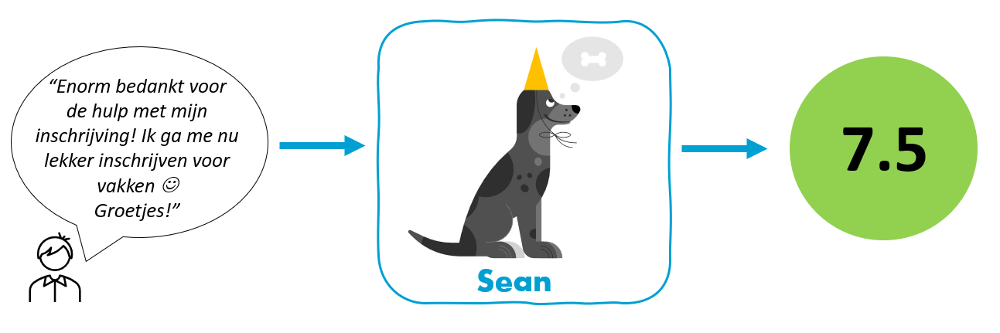

# SEAN

Team Data & Analytics is starting project Sean: develop an algorithm that performs sentiment analysis on text with the aim of providing a sentiment score, specifically aimed at HU student-related data (STudent Information Point requests, open-ended questions from student questionnaires, HU twitter, etc.). We aim to develop a product that can be re-used (and further developed) within the HU for any purpose and goal, and will become available through GitHub.

We can use any help and knowledge we can get, so we don't have to "reinvent the wheel". So if you have experience regarding sentiment analysis, or Dutch sentiment libraries let us know! Please reach out to me via Teams chat, or email (fraukje.coopmans\@hu.nl) if you would like to offer help of some sort!
