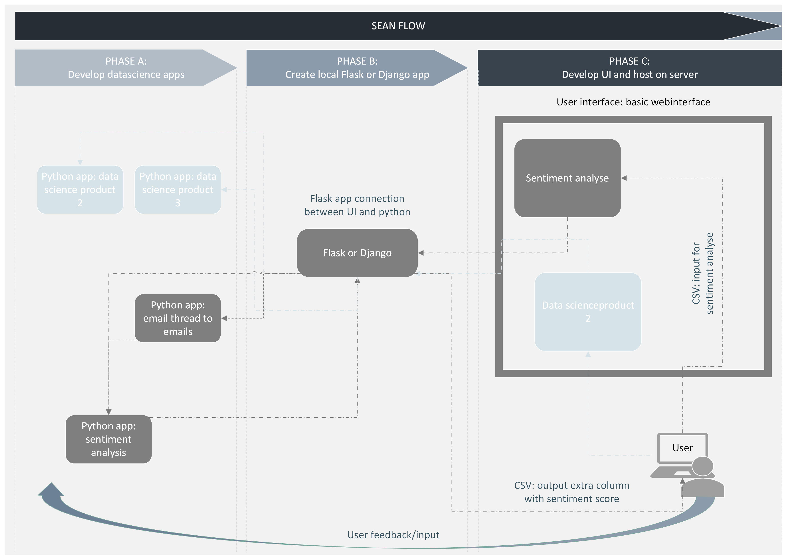
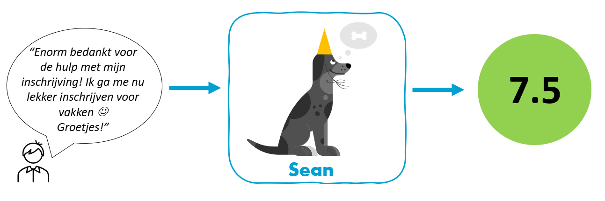

# SEAN

## Overview
The goal of this project is to develop off-the-shelf data-science products. We aim to make those products accessible via a web interface both for students and HU employees. The following image shows a rough outline of the project workflow.

As seen in the above schema the flow can be divided roughly three phases. The phases are dependent on each other but can be developed separately.

## Phase A
Goal of the project is to create off the shelf data science products develop in python (or any other langue). These products can run as an independent app locally or can be trigger via an online UI. They can run independently or can be combined. In the current working version, we developed two applications
1.  Sentiment analysis application: an algorithm that performs sentiment analysis on text with the aim of providing a sentiment score, specifically aimed at HU student-related data (Student Information Point requests, open-ended questions from student questionnaires, HU twitter, etc.). This application takes a CSV file containing two columns, an id column and a text column. The text column is scanned through the sentiment analysis, an extra column is created with the sentiment score. A CSV with this extra column is than returned to the user. More info about this application can be found [here.](results\resultaten-versie-0.2.md)
2.  Email thread to email app: this application splits email threads into separate emails and saves them in separate columns. It takes a csv file with two columns, an id column and a column with email thread. It splits the email thread into column and returns a csv file. 

As stated, both apps can be run independently from each other but the output of the email thread to email app can be used for the sentiment app as well. 
The schema in the overview bullet shows a view greyed out applications. The projects aim is to create a framework where we can easily add more products (applications in the future). We aim to build a grid where containers can be added (or detached) without impacting any of the outer containers in the grid. Even if there is an interdependence between containers, since the goals is that they are always capable of running independently (as for example the email thread and sentiment analysis)

>NOTE! in phase A we develop the apps locally. These are python scripts that run on a local (or virtual) machine that can not be accessed via the web or any other interface. 

## Phase B

- Develop flask app (or maybe Django?)
  - Flask is a web framework written in python. 
- Local hosted
  - In phase B the framework is developed and tested locally. 
  

## Phase C

-   Create UI 
    -   Connect to Flask app
-   Where do we host 
    -   Azure function App with HTTP Trigger? More info [here](https://learn.microsoft.com/en-us/samples/azure-samples/flask-app-on-azure-functions/azure-functions-python-create-flask-app/)

## Feedback loop
The goal of the project is that there will be a continues feedback loop between the user and developers. This can be to either enhance existing apps or make recommendations for new features. 

> 
    Development team: Anne Leemans (lead) & Fraukje Coopmans
